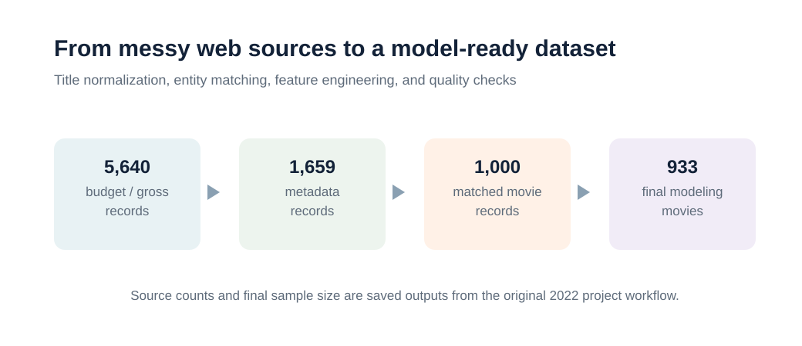
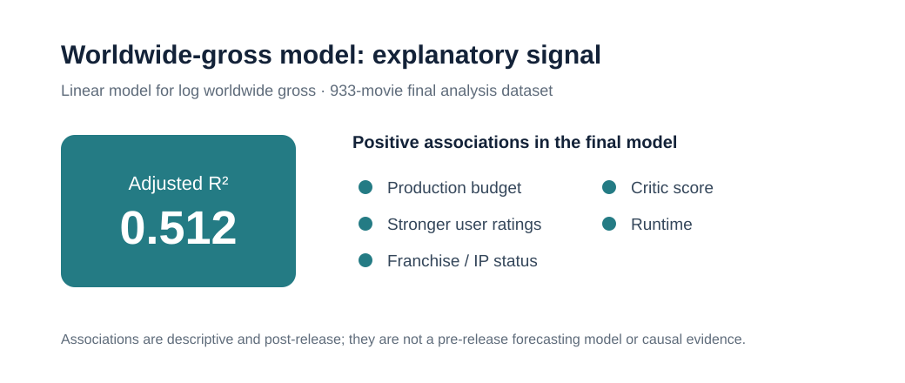
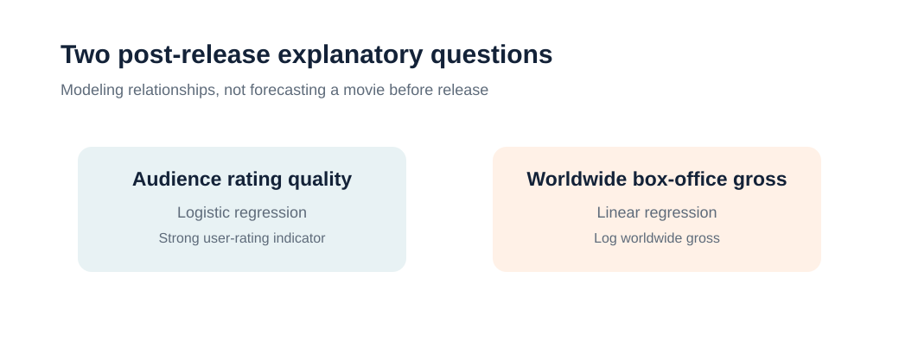

# Movie Success Analysis: Web Scraping and Regression Modeling

**UC Davis STA 141B final project** · **Python, web scraping, entity matching, regression**

> An end-to-end data analysis workflow that combines messy public web sources to study post-release relationships with audience ratings and worldwide box-office performance.

## Executive Summary

I collected and integrated movie budget, revenue, ratings, critic score, Oscar history, franchise/IP, and metadata from multiple public sources. After standardizing titles and resolving cross-source matching issues, I built a 933-movie analysis table and used logistic and linear regression to examine audience-rating quality and worldwide gross. The final explanatory worldwide-gross model reported an adjusted **R² of about 0.512**.

## My Role

- Built web-scraping and parsing workflows for movie budget, revenue, and metadata sources.
- Cleaned inconsistent movie-title text and matched entities across source systems.
- Engineered model-ready financial, ratings, runtime, franchise, and awards variables.
- Developed and interpreted logistic and linear regression models with VIF and residual diagnostics.

## Quick Review

| Review point | Portfolio evidence |
|---|---|
| Question | Which post-release movie characteristics help explain audience ratings and worldwide gross? |
| Data work | Multi-source web extraction, title normalization, entity matching, and feature engineering |
| Key result | Final log-worldwide-gross model: adjusted **R² ≈ 0.512** |
| Boundary | Explanatory post-release analysis—not a pre-release forecast or causal study |

- [Analysis notebook](notebooks/movie_success_analysis.ipynb)
- [Results summary](docs/results_summary.md)
- [Data dictionary](docs/data_dictionary.md)
- [Data-access guide](data/README.md)

## Research Questions

1. Which movie characteristics are associated with a stronger audience rating?
2. Which production, audience, and franchise characteristics are associated with worldwide gross?
3. How can separate and inconsistent web sources be transformed into one movie-level analysis dataset?

## Data Integration

<p align="center">
  
</p>

The main analytical challenge was source integration: normalizing movie names, resolving punctuation and encoding differences, aligning titles across tables, then building interpretable numerical, binary, and categorical features.

## Key Findings

- The final worldwide-gross model explained about half of the variation in log worldwide gross (**adjusted R² ≈ 0.512**).
- Higher production budgets, stronger audience ratings, franchise/IP status, critic score, and runtime were positively associated with worldwide gross in the final model.
- The analysis surfaced multicollinearity among some rating dummy variables, so diagnostic checks and reduced-model comparisons were included rather than hidden.
- Prior Oscar recognition for the lead actor or director did not clearly explain worldwide gross after the other modeled factors were considered.

<p align="center">
  
</p>

<p align="center">
  
</p>

## Analysis and Documentation

| Resource | Description |
|---|---|
| [Analysis notebook](notebooks/movie_success_analysis.ipynb) | Original Python workflow for scraping, cleaning, matching, feature engineering, and modeling; outputs were cleared for a data-safe public copy |
| [Results summary](docs/results_summary.md) | Interpretation of the original saved model outputs and limitations |
| [Data dictionary](docs/data_dictionary.md) | Definitions of the modeled features |
| [Assignment context](docs/assignment_context.md) | Original course-project context |
| [Data-access guide](data/README.md) | Public-release and reproducibility boundary |

## Methods at a Glance

1. Extract budget/gross and movie metadata from public web sources.
2. Normalize title text, release-year formats, punctuation, and encodings.
3. Match records across sources and engineer financial, ratings, awards, and franchise features.
4. Fit logistic regression for the strong-user-rating indicator.
5. Fit linear regression for log worldwide gross and review multicollinearity and residual diagnostics.
6. Report findings as post-release associations, with limitations clearly stated.

## Data and Reproducibility

Source extracts and row-level analysis tables are intentionally excluded. The original project dates to 2022, so websites and page layouts may have changed. See [data/README.md](data/README.md) for the public-release boundary and [requirements.txt](requirements.txt) for the analysis environment.

To inspect the workflow locally:

```bash
python -m venv .venv
source .venv/bin/activate
pip install -r requirements.txt
jupyter notebook notebooks/movie_success_analysis.ipynb
```

The notebook is a code review artifact. It needs locally recreated inputs and likely scraper maintenance before a full rerun.

## Repository Structure

```text
.
├── data/          # access guidance; no source extracts or row-level records
├── docs/          # results, data dictionary, and project context
├── figures/       # aggregate portfolio visuals based on recorded results
├── notebooks/     # original analysis code with outputs removed
├── README.md
└── requirements.txt
```
